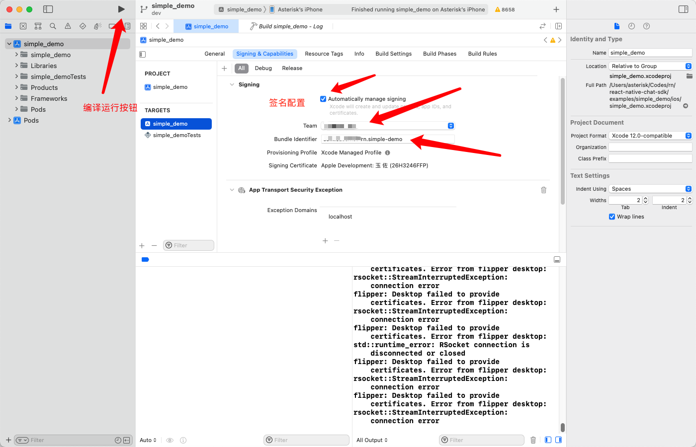
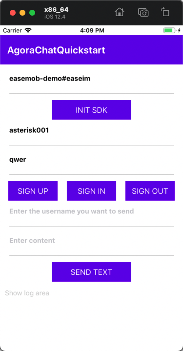

_English | [Chinese](./README.zh.md)_

Update time: 2022-06-16

# Huanxin IM React-Native Quick Start

This article introduces how to integrate the React-Native SDK of Huanxin Instant Messaging in a minimal way to send and receive single-chat text messages in your app.

## Implementation principle

The following diagram shows the workflow for sending and receiving one-to-one text messages on the client side.

[](https://docs-im.easemob.com/_detail/ ccim/web/sendandreceivemsg.png?id=ccim%3Aandroid%3Amessage2)

## Preconditions

Before integrating, please confirm that the development and running environment of the app meets the following requirements:

For iOS platform:

- MacOS 10.15.7 or above
- Xcode 12.4 or above, including command line tools
- React Native 0.63.4 or above
- NodeJs 16 or above, including npm package management tool
- CocoaPods package management tool
- Yarn compile and run tool
- Watchman debugging tool
- Operating environment real machine or simulator iOS 10.0 or above

For Android platform:

- MacOS 10.15.7 or above, Windows 10 or above
- Android Studio 4.0 or above, including JDK 1.8 or above
- React Native 0.63.4 or above
- If you develop with Macos system, you need CocoaPods package management tool
- If developing on Windows, Powershell 5.1 or above is required
- NodeJs 16 or above, including npm package management tool
- Yarn compile and run tool
- Watchman debugging tool
- Operating environment real machine or emulator Android 6.0 or above

If you encounter problems in configuring the development or running environment, please refer to [RN official website](https://reactnative.dev/).

### other requirements

- Valid Huanxin IM developer account and App key, see [Huanxin IM Cloud Management Background](https://console.easemob.com/user/login).

## project settings

Create a React Native project and integrate it

1. Prepare the development environment according to the development system and target platform;
2. Open the terminal, enter the directory where the project needs to be created, and enter the command to create the React Native project:

```sh
npx react-native init simple_demo
cd simple_demo
yarn
```

The name of the created project is `simple_demo`.

3. On the terminal command line, enter the following command to add dependencies:

   ```sh
   yarn add react-native-chat-sdk
   ```

4. Execute the script on the target platform

Android:

```sh
cd node_modules/react-native-chat-sdk/native_src/cpp && sh generate.sh --type rn && cd ../../../..
```

iOS:

```sh
cd ios && pod install && cd ..
```

## Implement sending and receiving single chat messages

Before sending a single chat message, end users need to register a Chat account and log in.

It is recommended to use `visual studio code` to open the folder `simple_demo`, open the file `App.js`, delete all contents, and add the following:

```typescript
import React, {useEffect} from 'react';
import {
  SafeAreaView,
  ScrollView,
  StyleSheet,
  Text,
  TextInput,
  View,
} from 'react-native';
import {
  ChatClient,
  ChatOptions,
  ChatMessageChatType,
  ChatMessage,
} from 'react-native-chat-sdk';

// The App Object.
const App = () => {
  const title = 'AgoraChatQuickstart';
  const [appKey, setAppKey] = React.useState('easemob-demo#easeim');
  const [username, setUsername] = React.useState('asterisk001');
  const [password, setPassword] = React.useState('qwer');
  const [userId, setUserId] = React.useState('');
  const [content, setContent] = React.useState('');
  const [logText, setWarnText] = React.useState('Show log area');

  // output console log.
  useEffect(() => {
    logText.split('\n').forEach((value, index, array) => {
      if (index === 0) {
        console.log(value);
      }
    });
  }, [logText]);

  // output ui log.
  const rollLog = text => {
    setWarnText(preLogText => {
      let newLogText = text;
      preLogText
        .split('\n')
        .filter((value, index, array) => {
          if (index > 8) {
            return false;
          }
          return true;
        })
        .forEach((value, index, array) => {
          newLogText += '\n' + value;
        });
      return newLogText;
    });
  };

  // register listener for message.
  const setMessageListener = () => {
    let msgListener = {
      onMessagesReceived(messages) {
        for (let index = 0; index < messages.length; index++) {
          rollLog('received msgId: ' + messages[index].msgId);
        }
      },
      onCmdMessagesReceived: messages => {},
      onMessagesRead: messages => {},
      onGroupMessageRead: groupMessageAcks => {},
      onMessagesDelivered: messages => {},
      onMessagesRecalled: messages => {},
      onConversationsUpdate: () => {},
      onConversationRead: (from, to) => {},
    };

    ChatClient.getInstance().chatManager.removeAllMessageListener();
    ChatClient.getInstance().chatManager.addMessageListener(msgListener);
  };

  // Init sdk.
  // Please initialize any interface before calling it.
  const init = () => {
    let o = new ChatOptions({
      autoLogin: false,
      appKey: appKey,
    });
    ChatClient.getInstance().removeAllConnectionListener();
    ChatClient.getInstance()
      .init(o)
      .then(() => {
        rollLog('init success');
        this.isInitialized = true;
        let listener = {
          onTokenWillExpire() {
            rollLog('token expire.');
          },
          onTokenDidExpire() {
            rollLog('token did expire');
          },
          onConnected() {
            rollLog('login success.');
            setMessageListener();
          },
          onDisconnected(errorCode) {
            rollLog('login fail: ' + errorCode);
          },
        };
        ChatClient.getInstance().addConnectionListener(listener);
      })
      .catch(error => {
        rollLog(
          'init fail: ' +
            (error instanceof Object ? JSON.stringify(error) : error),
        );
      });
  };

  // register account for login
  const registerAccount = () => {
    if (this.isInitialized === false || this.isInitialized === undefined) {
      rollLog('Perform initialization first.');
      return;
    }
    rollLog('start register account ...');
    ChatClient.getInstance()
      .createAccount(username, password)
      .then(response => {
        rollLog(`register success: userName = ${username}, password = ******`);
      })
      .catch(error => {
        rollLog('register fail: ' + JSON.stringify(error));
      });
  };

  // login with account id and password
  const loginWithPassword = () => {
    if (this.isInitialized === false || this.isInitialized === undefined) {
      rollLog('Perform initialization first.');
      return;
    }
    rollLog('start login ...');
    ChatClient.getInstance()
      .login(username, password)
      .then(() => {
        rollLog('login operation success.');
      })
      .catch(reason => {
        rollLog('login fail: ' + JSON.stringify(reason));
      });
  };

  // logout from server.
  const logout = () => {
    if (this.isInitialized === false || this.isInitialized === undefined) {
      rollLog('Perform initialization first.');
      return;
    }
    rollLog('start logout ...');
    ChatClient.getInstance()
      .logout()
      .then(() => {
        rollLog('logout success.');
      })
      .catch(reason => {
        rollLog('logout fail:' + JSON.stringify(reason));
      });
  };

  // send text message to somebody
  const sendmsg = () => {
    if (this.isInitialized === false || this.isInitialized === undefined) {
      rollLog('Perform initialization first.');
      return;
    }
    let msg = ChatMessage.createTextMessage(
      userId,
      content,
      ChatMessageChatType.PeerChat,
    );
    const callback = new (class {
      onProgress(locaMsgId, progress) {
        rollLog(`send message process: ${locaMsgId}, ${progress}`);
      }
      onError(locaMsgId, error) {
        rollLog(`send message fail: ${locaMsgId}, ${JSON.stringify(error)}`);
      }
      onSuccess(message) {
        rollLog('send message success: ' + message.localMsgId);
      }
    })();
    rollLog('start send message ...');
    ChatClient.getInstance()
      .chatManager.sendMessage(msg, callback)
      .then(() => {
        rollLog('send message: ' + msg.localMsgId);
      })
      .catch(reason => {
        rollLog('send fail: ' + JSON.stringify(reason));
      });
  };

  // ui render.
  return (
    <SafeAreaView>
      <View style={styles.titleContainer}>
        <Text style={styles.title}>{title}</Text>
      </View>
      <ScrollView>
        <View style={styles.inputCon}>
          <TextInput
            multiline
            style={styles.inputBox}
            placeholder="Enter appkey"
            onChangeText={text => setAppKey(text)}
            value={appKey}
          />
        </View>
        <View style={styles.buttonCon}>
          <Text style={styles.btn2} onPress={init}>
            INIT SDK
          </Text>
        </View>
        <View style={styles.inputCon}>
          <TextInput
            multiline
            style={styles.inputBox}
            placeholder="Enter username"
            onChangeText={text => setUsername(text)}
            value={username}
          />
        </View>
        <View style={styles.inputCon}>
          <TextInput
            multiline
            style={styles.inputBox}
            placeholder="Enter password"
            onChangeText={text => setPassword(text)}
            value={password}
          />
        </View>
        <View style={styles.buttonCon}>
          <Text style={styles.eachBtn} onPress={registerAccount}>
            SIGN UP
          </Text>
          <Text style={styles.eachBtn} onPress={loginWithPassword}>
            SIGN IN
          </Text>
          <Text style={styles.eachBtn} onPress={logout}>
            SIGN OUT
          </Text>
        </View>
        <View style={styles.inputCon}>
          <TextInput
            multiline
            style={styles.inputBox}
            placeholder="Enter the username you want to send"
            onChangeText={text => setUserId(text)}
            value={userId}
          />
        </View>
        <View style={styles.inputCon}>
          <TextInput
            multiline
            style={styles.inputBox}
            placeholder="Enter content"
            onChangeText={text => setContent(text)}
            value={content}
          />
        </View>
        <View style={styles.buttonCon}>
          <Text style={styles.btn2} onPress={sendmsg}>
            SEND TEXT
          </Text>
        </View>
        <View>
          <Text style={styles.logText} multiline={true}>
            {logText}
          </Text>
        </View>
        <View>
          <Text style={styles.logText}>{}</Text>
        </View>
        <View>
          <Text style={styles.logText}>{}</Text>
        </View>
      </ScrollView>
    </SafeAreaView>
  );
};

const styles = StyleSheet.create({
  titleContainer: {
    height: 60,
    backgroundColor: '#6200ED',
  },
  title: {
    lineHeight: 60,
    paddingLeft: 15,
    color: '#fff',
    fontSize: 20,
    fontWeight: '700',
  },
  inputCon: {
    marginLeft: '5%',
    width: '90%',
    height: 60,
    paddingBottom: 6,
    borderBottomWidth: 1,
    borderBottomColor: '#ccc',
  },
  inputBox: {
    marginTop: 15,
    width: '100%',
    fontSize: 14,
    fontWeight: 'bold',
  },
  buttonCon: {
    marginLeft: '2%',
    width: '96%',
    flexDirection: 'row',
    marginTop: 20,
    height: 26,
    justifyContent: 'space-around',
    alignItems: 'center',
  },
  eachBtn: {
    height: 40,
    width: '28%',
    lineHeight: 40,
    textAlign: 'center',
    color: '#fff',
    fontSize: 16,
    backgroundColor: '#6200ED',
    borderRadius: 5,
  },
  btn2: {
    height: 40,
    width: '45%',
    lineHeight: 40,
    textAlign: 'center',
    color: '#fff',
    fontSize: 16,
    backgroundColor: '#6200ED',
    borderRadius: 5,
  },
  logText: {
    padding: 10,
    marginTop: 10,
    color: '#ccc',
    fontSize: 14,
    lineHeight: 20,
  },
});

export default App;
```

### Compile and run the project

Now you can start creating and running projects on the target platform.

Compile and run on real iOS device:

1. Connect the iPhone and set it to developer mode;
2. Open `simple_demo/ios`, use `xcode` to open `simple_demo.xcworkspace`;
3. Click **Targets** > **simple_demo** > **Signing & Capabilities** to set the application signature under the signature option;
4. Click `Build` to build and run the project. After the program is built, it will be automatically installed and run, and the application interface will be displayed.



Compile and run in iOS simulator

1. Open `simple_demo/ios`, use `xcode` to open `simple_demo.xcworkspace`;
2. In `xcode`, select the simulator `iphone13`;
3. Click `Build` to build and run the project. After the program is built, it will be automatically installed and run, and the application interface will be displayed.


Compile and run on real Android device

1. Open `simple_demo/android` in Android Studio;
2. Connect to Android phone, set to developer mode, and set USB adjustable;
3. Set data forwarding: enter `adb reverse tcp:8081 tcp:8081` in the terminal command line;
4. Start the service: execute the command in `package.json`: `"start": "react-native start"`, run the command `yarn start` in the terminal:

   ```sh
   yarn start
   ```

5. After the program is built, it will be installed and run automatically, and the application interface will be displayed.


Display demo main interface:


## Test your app

Refer to the following code to test registering an account, logging in, sending and receiving messages.

1. Enter the username and password on the real device or emulator, and click **Register**.
2. Click **Login**.
3. Register and log in a new user on another real machine or emulator.
4. Enter the username on the second machine on the first real machine or emulator, edit the message and click **Send** to receive the message on the second machine.

At the same time, you can view the log below to check whether the registration, login, and message sending are successful.

## more operations

To ensure security, we recommend using the `username + password + token` method to create a user. The token is generated on your app server for the client to obtain. When the token expires, you need to obtain it again. For details, see [Get user token](https://docs-im.easemob.com/ccim/rest/accountsystem#Get user_token).
